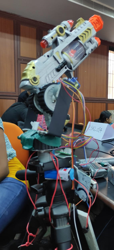

# Virtual Reality controlled Military Weapon
A virtual reality controlled machine gun that can be controlled from a distance using servo motor and stepper motors.
 
 ## Problem Statement
Soldier lives have been lost to small surprise attacks by enemies. When border troops are patrolling the LoC, there are surprise attacks during which these soldiers are unprepared and lose their lives. What if these lives could be saved by technology like virtual reality?

## Idea
A virtual reality headset controlled by a trained soldier is connected to an artillery stationed at the LoC, from a remote location.
The artillery has a camera attached to it and this is attached to a microcontroller which transmits the video to the VR headset.
The soldier can monitor the situation around the LoC and if there is any suspicious activity or surprise attack, he can control the movement and trigger of the gun from the virtual environment so that the artillery starts firing at the enemy based on the soldier's controls. This gives the army a head start so that they can prepare a strong counter attack and take the enemy by surprise.

## Tech Stack
* Video transmission - Using IP Webcam
* Gyroscope controlled Stepper Motors - Two stepper motors for Y Axis, One stepper motor for X Axis
* NRF - Transmission of signals
* Microcontroller - Virtual Reality (The use of 2 human senses, sight and feel)
* Button controlled Servo Motor - One servo motor for controlling the trigger

## Final Prototype

## Existing Technology
At present, there exist joystick controlled drones that conduct surveillance over air and can remotely fire missiles.This is a similar technology that can implemented on land and can simulate a real life battlefield without loss of any lives.

